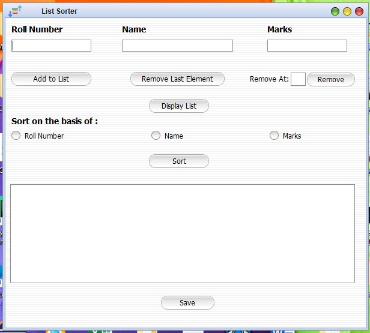

# Student-List-Sorter
A java Swing GUI list sorter app that sorts the list of students on the basis of roll number, name and marks, with function to add or delete entries and save the list in .docx format . 

